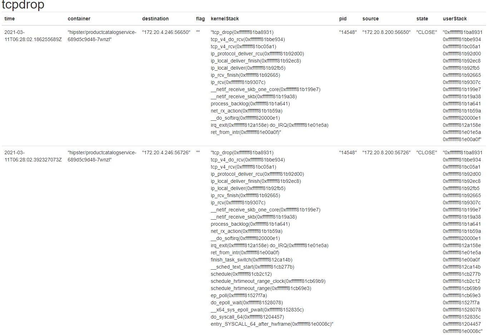

# Kmon
Implementation of paper [Kmon: An In-kernel Transparent Monitoring System
for Microservice Systems with eBPF]()

Kmon support some in-kernel indicator with different granularity.

## Screenshot

This exmample shows information such as packet details, socket state, and kernel packets/segments stack trace for dropped via tcp_drop(See [tcpdrop](https://github.com/iovisor/bcc/blob/master/tools/tcpdrop.py) in BCC). Kmon collect these infomation from program and export them to database.

The configuration of this example is like this.

```yaml
exporter:
  influxdb:
    - name: influx
      host: http://192.168.199.123:8086

collector:
  tcpdrop:
    - name: tcp_drop
      # ~1: drop_event
      # 2 : drop_event, user_stack
      # 3~: drop_event, user_stack, kernel_stack
      verbose: 3

      listen:
        # Regular expression to filter container
        # With format:[namespace]/[container name]
        k8s:
          - ".+/*"

      export:
        period: 1000
        data_name: tcpdrop
        exporter:
          - name: influx
            database: metrics

```

User can chose different verbose level, and configuration can be change dynamically by replace config file(not support add new and delete collector temporary).

See [Config Examples](deployment/config_example) for more configuration example.

## Collector
biostat: Trace latency and throughput of container and device.
fcount: Count the number of specific kernel function execution.
offcpu: Summarize off-CPU time by kernel stack or user stack trace.
tcpdrop: Trace kernel-based TCP packet drops with details.
tcpreq: Trace request by TCP packet for each container.

## Compile
# Docker
```bash
docker build .
```
Folder [deployment/kubernetes](deployment/kubernetes) shows an example to deploy Kmon in kubernetes.
# Binary
You should install [BCC](https://github.com/iovisor/bcc) and [golang](https://golang.google.cn/) befor compile.
```
make
```
